> {width="1.567567804024497in" height="1.6179166666666667in"}

# UNIVERSITAS ISLAM NEGERI SYARIF HIDAYATULLAH JAKARTA

**LAPORAN PRAKTIKUM ELEKTRONIKA DASAR**

> **Nama : Amanda Putri 11220970000015 Hakim Afif Putra 11220970000031**
>
> **Kintan Alifia 11220970000025**

## Nomor Kelompok 11

## Fakultas : Sains dan Teknologi

## Jurusan : Fisika

## Nomor Percobaan : Percobaan 1 Rangkaian Dasar Resistor Tanggal Percobaan : 14 Maret 2024

## Minggu ke- 2

> **Asisten : -**

# LAPORAN PRAKTIKUM RANGKAIAN DASAR RESISTOR

I.  **TUJUAN PRAKTIKUM**

    1.  Memahami rangkaian hukum Ohm dan hukum Kirchoff.

    2.  Menentukan nilai hambatan pada rangkaian hukum Ohm.

    3.  Menentukan arus dan tegangan yang akan dihasilkan pada rangkaian dengan mengamati tegangan yang jatuh pada resistor.

# DASAR TEORI

> 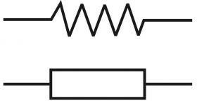{width="1.1018514873140857in" height="0.5664271653543307in"}Resistor adalah salah satu komponen elektronika pasif yang memiliki nilai resistansi atau hambatan tertentu. Fungsinya adalah untuk membatasi dan mengatur arus listrik dalam suatu rangkaian elektronika. Satuan hambatan atau resistansi resistor adalah ohm (Ω), yang diambil dari nama penemunya, yaitu Georg Simon Ohm. Dalam rangkaian, resistor biasanya disimbolkan sebagai berikut :
>
> *Gambar 1. Simbol resistor*
>
> Resistor dapat digunakan sebagai komponen utama dalam berbagai percobaan, salah satunya adalah percobaan untuk memvalidasi Hukum Ohm. Hukum Ohm merupakan hukum dasar dalam elektronika yang menyatakan hubungan antara arus listrik (I), tegangan (V), dan hambatan (R) dalam sebuah rangkaian listrik. Secara matematis, Hukum Ohm dapat dirumuskan sebagai berikut:
>
> 𝐼
>
> 𝑉 = 𝑅
>
> Di mana: V = Tegangan (Volt) I = Kuat arus (Ampere) R = Hambatan (Ω)
>
> 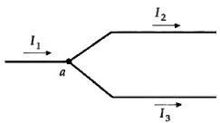{width="1.1800831146106736in" height="0.6604549431321085in"}Selain itu, resistor juga dapat digunakan dalam percobaan Hukum Kirchoff. Hukum Kirchoff dibagi menjadi dua bagian, Hukum Kirchoff 1 dan Hukum Kirchoff 2. Hukum Kirchoff 1 berbunyi, "Arus total yang masuk melalui suatu titik percabangan dalam suatu rangkaian listrik sama dengan arus total yang keluar dari titik percabangan tersebut".
>
> *Gambar 2. Hukum Kirchoff*
>
> Secara matematis, Hukum Kirchoff 1 dapat dirumuskan menjadi :
>
> ∑ 𝐼𝑚𝑎𝑠𝑢𝑘 = ∑ 𝐼𝑘𝑒𝑙𝑢𝑎𝑟
>
> Hukum Kirchoff 2 digunakan untuk menganalisis tegangan komponen-komponen elektronika dalam suatu rangkaian tertutup. Hukum Kirchoff 2 berbunyi, "Total tegangan pada suatu rangkaian tertutup adalaha nol". Secara matematis, Hukum Kirchoff 2 dapat dirumuskan menjadi :
>
> ∑ ∈ = ∑ 𝐼𝑅

# METODOLOGI PERCOBAAN

## Percobaan 1 Rangkaian Resistor Berdasarkan Hukum Ohm

1.  **Alat dan Bahan**

    1.  Resistor 5 buah

    2.  Potensiometer 1 buah

    3.  Power supply 0-12 Vdc 1 buah

    4.  Multimeter 1 buah

## Prosedur Percobaan

1.  Menyusun rangkaian seperti pada gambar dibawah.

2.  Memvariasikan tegangan input dari 0 V sampai 10 V, kemudian mencatat perubahan arus dan tegangan pada setiap perubahan tegangan input.

## Percobaan 2 Rangkaian Berdasarkan Hukum Kirchoff

1.  **Alat dan Bahan**

    1.  Resistor 3 buah

    2.  Potensiometer 1 buah

    3.  Power supply 12 Vdc 2 buah

    4.  Multimeter 1 buah

    5.  Terminal Chassis 1 buah

## Prosedur Percobaan

1.  Menyusun rangkaian seperti pada gambar dibawah

2.  Memberikan input tegangan pada masing-masing power supply sebesar 12 V, kemudian mencatat perubahan tegangan dan arus yang dihasilkan.

# HASIL & PEMBAHASAN

## Percobaan 1 Rangkaian Resistor Berdasarkan Hukum Ohm

1.  **Data Percobaan**

+-------+-----------------+-----------------------+-----------------+
| > No. | > Tegangan      | > Perubahan Arus (𝑚𝐴) | Tegangan        |
|       | >               |                       |                 |
|       | > Input (𝑉~𝑖𝑛~) |                       | Output (𝑉~𝑜𝑢𝑡~) |
+=======+=================+=======================+=================+
| > 1   | 0               | 0                     | 0               |
+-------+-----------------+-----------------------+-----------------+
| > 2   | 1               | 0,97                  | 0,35            |
+-------+-----------------+-----------------------+-----------------+
| > 3   | 2               | 1,94                  | 0,71            |
+-------+-----------------+-----------------------+-----------------+
| > 4   | 3               | 2,9                   | 1,06            |
+-------+-----------------+-----------------------+-----------------+
| > 5   | 4               | 3,87                  | 1,42            |
+-------+-----------------+-----------------------+-----------------+
| > 6   | 5               | 4,84                  | 1,77            |
+-------+-----------------+-----------------------+-----------------+
| > 7   | 6               | 5,81                  | 2,13            |
+-------+-----------------+-----------------------+-----------------+
| > 8   | 7               | 6,77                  | 2,48            |
+-------+-----------------+-----------------------+-----------------+
| > 9   | 8               | 7,74                  | 2,28            |
+-------+-----------------+-----------------------+-----------------+
| > 10  | 9               | 8,71                  | 3,19            |
+-------+-----------------+-----------------------+-----------------+
| > 11  | 10              | 9,68                  | 3,55            |
+-------+-----------------+-----------------------+-----------------+

> Dimana diketahui bahwa Nilai R-nya :
>
> 𝑅~1~= 2k = 2000Ώ
>
> 𝑅~2~= 1K = 1000Ώ
>
> 𝑅~3~= 1K1= 1100Ώ

## Pengolahan data

> 𝑅~4~= 1K1= 1100Ώ
>
> 𝑅~5~= 1K1= 1100Ώ

+-------+-------------+-----------+-----------+---------+----------+
| > No. | > 𝑋 = 𝐼 (𝐴) | 𝑌 = 𝑉 (𝑣) | 𝑥2        | 𝑦2      | 𝑥𝑦       |
+=======+=============+===========+===========+=========+==========+
| > 1   | > 0         | 0         | 0         | 0       | 0        |
+-------+-------------+-----------+-----------+---------+----------+
| > 2   | > 0,97      | 0,35      | 0,9409    | 0,1225  | 0,3395   |
+-------+-------------+-----------+-----------+---------+----------+
| > 3   | > 1,94      | 0,71      | 3,7636    | 0,5041  | 1,3774   |
+-------+-------------+-----------+-----------+---------+----------+
| > 4   | > 2,9       | 1,06      | 8,41      | 1,1236  | 3,074    |
+-------+-------------+-----------+-----------+---------+----------+
| > 5   | > 3,87      | 1,42      | 14,9769   | 2,0164  | 5,4954   |
+-------+-------------+-----------+-----------+---------+----------+
| > 6   | > 4,84      | 1,77      | 23,4256   | 3,1329  | 8,5668   |
+-------+-------------+-----------+-----------+---------+----------+
| > 7   | > 5,81      | 2,13      | 33,7561   | 4,5369  | 12,3753  |
+-------+-------------+-----------+-----------+---------+----------+
| > 8   | > 6,77      | 2,48      | 45,8329   | 6,1504  | 16,7896  |
+-------+-------------+-----------+-----------+---------+----------+
| > 9   | > 7,74      | 2,84      | 59,9076   | 5,1984  | 17,6472  |
+-------+-------------+-----------+-----------+---------+----------+
| > 10  | > 8,71      | 3,19      | 75,8641   | 10,1761 | 27,7849  |
+-------+-------------+-----------+-----------+---------+----------+
| > 11  | > 9,68      | 3,55      | 93,7024   | 12,6025 | 34,364   |
+-------+-------------+-----------+-----------+---------+----------+
| > Σ   | > 53,23     | 19,5      | 360,5801  | 48,431  | 132,1485 |
+-------+-------------+-----------+-----------+---------+----------+

## Menghitung nilai regresi a

> a = (∑𝑦)(∑𝑥2)−(∑𝑥)(∑𝑥𝑦)
>
> 𝑛(∑𝑥2)−(∑𝑥)2
>
> a = (19.5)(360,5801)−(53,23)(132,1485)
>
> 11(360,5801)−(53,23)2
>
> a = **-0.002606**

## Menghitung nilai regresi b :

> b = 𝑛(∑𝑥𝑦)−(∑𝑥)(∑𝑦)
>
> 𝑛(∑𝑥2)−(∑𝑥)2
>
> b = 11(132,1485)−(53,23)(19.5)
>
> 11(360,5801)−(53,23)2
>
> b = **366,874**

## Menghitung nilai regresi r :

> r = 𝑛(∑𝑥𝑦)−(∑𝑥)(∑𝑦)
>
> √𝑛(∑𝑥2−(∑𝑥)2))(𝑛(∑𝑦2−(∑𝑦))2
>
> r = 11(132,1485)−(53,23)(19.5)
>
> √11(360,5801−(53,23)2))(11((48,431−(19.5))2
>
> r = **0.99**

## Menentukan kesalahan literatur :

> a = **-0.002606**
>
> b = 366,874
>
> b → Xbar = **366,874**

1

𝑋𝑙𝑖𝑡

> = 1
>
> 𝑅3
>
> \+ 1
>
> 𝑅4
>
> \+ 1
>
> 𝑅5
>
> 1
>
> 𝑋𝑙𝑖𝑡 1
>
> 𝑋𝑙𝑖𝑡
>
> = 1
>
> 1100
>
> = 3
>
> 3300

\+ 1

> 1100
>
> \+ 1
>
> 1100

𝑋𝑙𝑖𝑡

> = ^3300^ = 1100Ω
>
> 3
>
> KL =\[ 𝑋𝘣𝑎r− 𝑋𝑙𝑖𝑡\] x 100%
>
> 𝑋𝑙𝑖𝑡
>
> KL = \[ ^366,874−1100^\] x 100% = **0.0564544%**
>
> 1100
>
> Tegangan Output (𝑉𝑜𝑢𝑡)
>
> Dalam percobaan ini, kita mengikuti Hukum Ohm yang menyatakan bahwa arus listrik yang mengalir melalui suatu penghantar berbanding lurus dengan beda potensial yang diterapkan kepadanya. Hukum ini dijabarkan dalam persamaan V = I.R, di mana V adalah beda potensial, I adalah arus listrik, dan R adalah resistansi penghantar.
>
> Rangkaian resistor disusun secara paralel sesuai dengan petunjuk arahan untuk memastikan hasil percobaan sesuai dengan ekspektasi. Nilai resistansi resistor yang digunakan adalah 1K, 2K, dan 1K1.
>
> Pengambilan data dilakukan sebanyak 11 kali percobaan dengan variasi tegangan input dari 0V hingga 10V. Hasil percobaan menunjukkan bahwa ketika tegangan input adalah 0V, arus yang mengalir dan tegangan yang dihasilkan adalah 0,00mA dan 0,00V secara berturut-turut. Sementara itu, ketika tegangan input naik hingga 10V, arus yang mengalir dan tegangan yang dihasilkan juga meningkat secara proporsional. Dengan menggunakan rumus regresi, kelompok kami mendapatkan nilai koefisien regresi a sebesar -0.002606 dan regresi b sebesar 366,874. Nilai regresi b ini digunakan sebagai Xbar (nilai eksperimen), sedangkan nilai resistansi penghantar yang digunakan (Xlit) sebesar 1100Ω dengan kesalahan literatur sebesar 0.0564544%.
>
> Dari pembahasan di atas, dapat disimpulkan bahwa hasil percobaan sesuai dengan Hukum Ohm, yang menyatakan bahwa arus listrik yang mengalir melalui suatu penghantar berbanding lurus dengan beda potensial yang diterapkan kepadanya, dengan nilai resistansi yang konstan.

## Percobaan 2 Rangkaian Resistor Berdasarkan Hukum Kirchoff

1.  **Data Percobaan**

+-------+--------------------------+----------------+
| > No. | Tegangan Output (𝑉~𝑜𝑢𝑡~) | Kuat Arus (𝑚𝐴) |
+=======+==========================+================+
| > 1   | 8                        | 8              |
+-------+--------------------------+----------------+

> Dimana diketahui bahwa Nilai R-nya :
>
> 𝑅~1~= 1k = 1000Ώ
>
> 𝑅~2~= 1K = 1000Ώ
>
> 𝑅~3~ = 1K= 1000Ώ

2.  **Pengolahan Data Menghitung nilai** 𝐼~1~**,** 𝐼~2~**,** 𝐼~3~ **:**

## Loop 1 :

> ∑Е + ∑IR = 0
>
> (-𝐸~1~ + 𝐸~2~) + (I𝑅~1~ + 𝐼~3~𝑅~3~) = 0
>
> (-12 + 12) + (1.000𝐼~1~ + 1.000(𝐼~1~ + 𝐼~2~) = 0
>
> **(2.000**𝐼~1~ + 1. 000𝐼~2~) = 0 **(Persamaan 1)**

## Loop 2 :

> ∑Е + ∑IR = 0
>
> (𝐸~1~) + ( 𝐼~2~𝑅~2~+ 𝐼~3~𝑅~3~) = 0
>
> (-12) + (1.000𝐼~2~ + 1.000𝐼~3~) = 0
>
> 𝑉~𝑖𝑛~1 = 12 𝑣
>
> 𝑉~𝑖𝑛~2 = 12 𝑣
>
> (-12) + (1.000𝐼~2~ + 1.000 (𝐼~1~ + 𝐼~2~ )) = 0
>
> (-12) + (2.000𝐼~2~ + 1.000𝐼~1~) = 0
>
> **(1.000**𝐼~1~ + 2. 000𝐼~2~) = 12 **(Persamaan 2)**

## Persamaan Eliminasi dan Substitusi :

> 2.000𝐼~1~ + 1.000𝐼~2~ = 0 → x2
>
> 1.000𝐼~1~ + 2.000𝐼~2~ = 12 → x1

## Menjadi :

> 4.000𝐼1 + 2.000𝐼2 = 0
>
> [1.000𝐼1 + 2.000𝐼2 = 12]{.underline} --
>
> 3.000𝐼1= −12

𝐼~1~

> **=** −12
>
> 3.000

##  = -0,004A = -4mA

## 

> **Substitusi Persamaan ke-1**
>
> 2.000 x (-0,004) + 1.000𝐼~2~ = 0
>
> -8 + 1.000𝐼~2~ = 0
>
> 1.000𝐼~2~ = 8

𝐼~2~

> = 8
>
> 1000
>
> 𝐼~2~ **= 0,008A = 8mA**
>
> **Substitusi** 𝐼~1~ **dan** 𝐼~2~ **untuk mendapatkan nilai** 𝐼~3~ **:**
>
> 𝐼~3~ = 𝐼~1~+ 𝐼~2~
>
> 𝐼~3~ = (-0,004) + (0,008)
>
> 𝐼~3~ **= 0,004A = 4mA**
>
> 𝑉~3~ = (0,004)(1.000)
>
> 𝑉~3~ **= 4V**

## Menghitung Kesalahan Literatur :

- **Kesalahan Literatur Arus :**

> KL =\|𝑋𝘣𝑎r− 𝑋𝑙𝑖𝑡\| x 100%
>
> 𝑋𝑙𝑖𝑡
>
> KL = \|[8.00−8.00]{.underline}\| x 100%
>
> 8.00
>
> KL = \| [0]{.underline} \| x 100%
>
> 8.00

# KL = 0%

## Kesalahan Literatur Tegangan :

> KL =\|𝑋𝘣𝑎r− 𝑋𝑙𝑖𝑡\| x 100%
>
> 𝑋𝑙𝑖𝑡
>
> KL = \|[8.00−8.00]{.underline}\| x 100%
>
> 8.00
>
> KL = \| [0]{.underline} \| x 100%
>
> 8.00

# KL = 0%

## Pembahasan

> Dalam percobaan kedua ini, kita menerapkan Hukum Kirchoff, yang terdiri dari dua hukum dasar dalam rangkaian listrik, yaitu Hukum Tegangan Kirchoff dan Hukum Arus Kirchoff. Hukum Tegangan Kirchoff menyatakan bahwa jumlah tegangan dalam suatu loop tertutup pada rangkaian harus sama dengan jumlah tegangan yang jatuh di atas setiap komponen dalam loop tersebut. Sedangkan Hukum Arus Kirchoff menyatakan bahwa jumlah arus yang masuk ke simpul suatu rangkaian harus sama dengan jumlah arus yang keluar dari simpul tersebut.
>
> Dalam percobaan ini, terdapat dua loop pada rangkaian, sehingga kita membuat dua persamaan berdasarkan Hukum Kirchoff untuk menghitung nilai tegangan dan arus dalam rangkaian tersebut. Persamaan ini kemudian dipecahkan menggunakan metode eliminasi untuk mendapatkan nilai arus dan tegangan yang diinginkan.
>
> Rangkaian yang digunakan terdiri dari sumber tegangan DC (Direct Current) dan tiga resistor dengan nilai resistansi yang sama, yaitu R1, R2, R3 = 1K = 1000Ώ. Tegangan input yang diberikan pada sumber tegangan adalah 12V.
>
> Dari perhitungan yang dilakukan berdasarkan Hukum Kirchoff, diperoleh nilai arus pada masing-masing resistor, yaitu I1 sebesar -4mA, I2 sebesar 8mA, dan I3 sebesar 4mA. Selain itu, kesalahan literatur pada arus dan tegangan adalah 0%.
>
> Dengan demikian, percobaan ini mengkonfirmasi penerapan Hukum Kirchoff dalam mendapatkan nilai arus dan tegangan dalam rangkaian listrik.

# KESIMPULAN

> Dari praktikum rangkaian dasar yang mengacu pada Hukum Ohm dan Hukum Kirchoff, dapat disimpulkan bahwa kedua hukum ini memegang peranan penting dalam menganalisis serta memahami perilaku arus dan tegangan dalam rangkaian listrik.
>
> Hukum Ohm menyatakan bahwa arus listrik yang mengalir melalui suatu penghantar akan berbanding lurus dengan beda potensial yang diterapkan padanya. Dalam praktikum pertama, penggunaan Hukum Ohm terbukti relevan dalam memahami hubungan antara arus dan tegangan dalam sebuah rangkaian resistor. Penerapan praktis dari Hukum Ohm dalam aplikasi Proteus memungkinkan kita untuk memilih resistor dengan nilai tertentu, diidentifikasi melalui kode warna pada resistor.
>
> Sementara itu, Hukum Kirchoff, yang terdiri dari dua prinsip dasar, yaitu Hukum Kirchoff I dan II, berguna dalam menganalisis rangkaian listrik yang lebih kompleks. Dalam praktikum kedua, terapan Hukum Kirchoff II memungkinkan kita untuk mengukur arus dan tegangan dalam rangkaian dengan beberapa tahanan, baik rangkaian seri
>
> maupun paralel. Dengan menerapkan kedua hukum ini, kita dapat menghitung resistansi, arus, dan tegangan dalam rangkaian dengan akurat.
>
> Kesimpulannya, praktikum ini memberikan pemahaman yang kuat tentang dasar-dasar rangkaian listrik, baik dari perspektif Hukum Ohm yang menggambarkan hubungan antara arus dan tegangan pada penghantar, maupun Hukum Kirchoff yang membantu dalam menganalisis rangkaian listrik yang lebih kompleks.

# REFERENSI

> \[1.\] Fajar Zulkautsari, Andika Dwi, Hafsyah Sarah. Laporan Praktikum Elektronika Dasar. UIN Syarif Hidayatullah Jakarta. 2020.
>
> \[2.\] Tipler, Paul A., Fisika untuk Sains dan Teknik, Jilid 1 dan 2, Edisi 3, terjemahan "Physics for Scientists and Engineer", Penerbit Erlangga, Jakarta, 1998.
>
> \[3.\] Halliday, D. and Resnick, R., Fisika, Jilid 1 dan 2, Edisi 3, terjemahan, "Physics", Penerbit Erlangga, Jakarta, 1984.
>
> \[4.\] Leybold didactic, [[http://www.leybold-didactic.de/]{.underline}](http://www.leybold-didactic.de/)
>
> \[5.\] Syahwil, M., Panduan Mudah Simulasi dan Praktik Mikrokontroler Arduino, Penerbit ANDI, Yogyakarta, 2013.

# 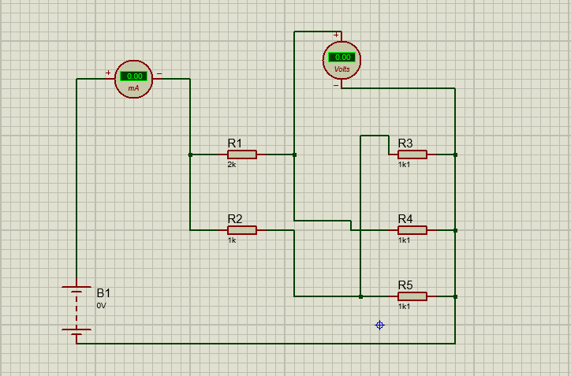{width="3.6174015748031496in" height="2.385in"}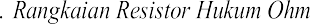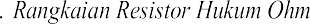LAMPIRAN

> {width="0.3831386701662292in" height="9.944335083114611e-2in"} *5*

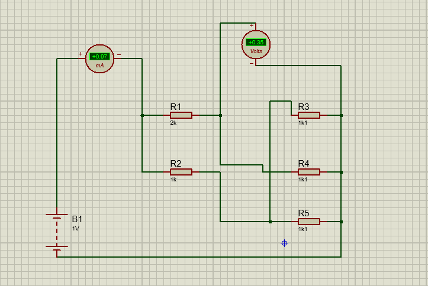{width="3.618984033245844in" height="2.42in"}

> {width="0.38314304461942256in" height="9.938867016622922e-2in"} *6*
>
> 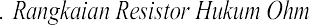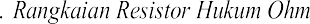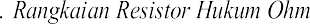{width="3.5731463254593177in" height="2.354998906386702in"}
>
> 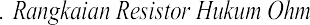{width="0.3831386701662292in" height="9.944444444444445e-2in"} *7*

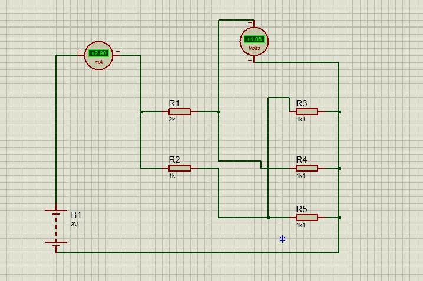{width="3.593707349081365in" height="2.39in"}

> {width="0.3831386701662292in" height="9.944335083114611e-2in"} *8*

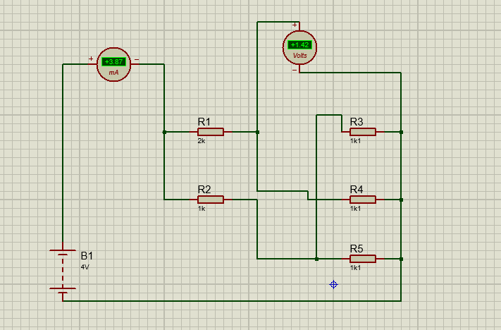{width="3.5568821084864393in" height="2.34in"}

> {width="0.3831386701662292in" height="9.944444444444445e-2in"} *9*

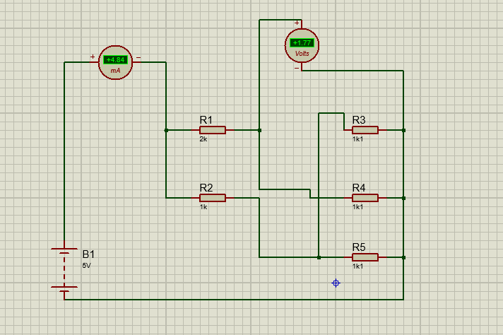{width="3.5594838145231846in" height="2.37in"}

> {width="0.38314304461942256in" height="9.938867016622922e-2in"} *10*
>
> 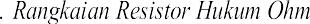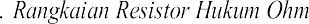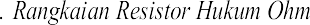{width="3.5994149168853893in" height="2.375in"}
>
> 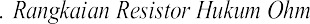{width="0.3831386701662292in" height="9.944335083114611e-2in"} *11*

{width="3.615164041994751in" height="2.373437226596675in"}

> {width="0.3831386701662292in" height="9.944444444444445e-2in"} *12*

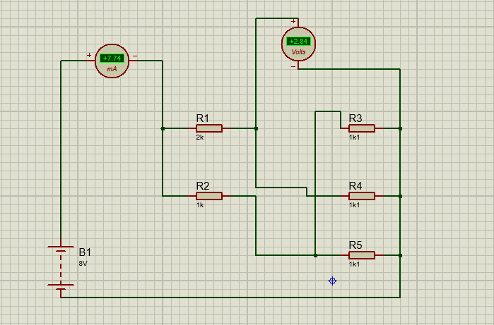{width="3.569313210848644in" height="2.353020559930009in"}

> {width="0.3831386701662292in" height="9.944335083114611e-2in"} *13*

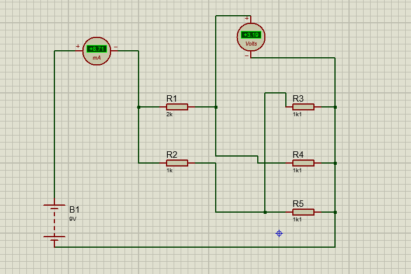{width="3.5907108486439197in" height="2.393853893263342in"}

> {width="0.38314304461942256in" height="9.938867016622922e-2in"} *14*
>
> 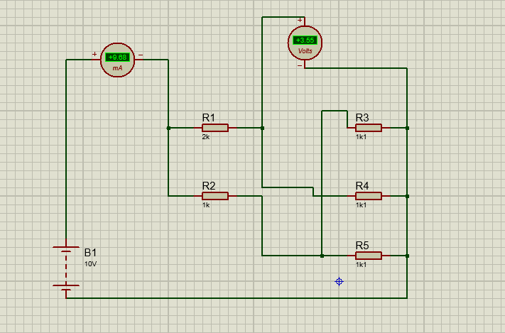{width="3.559095581802275in" height="2.345in"}
>
> 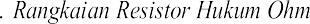{width="0.3831386701662292in" height="9.944335083114611e-2in"} *15*

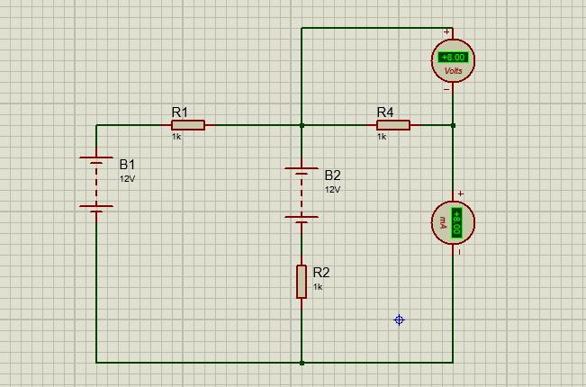{width="3.593676727909011in" height="2.373957786526684in"}

> {width="0.3831386701662292in" height="9.944335083114611e-2in"} *16*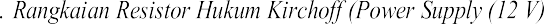{width="2.8308333333333335in" height="0.1275in"}
