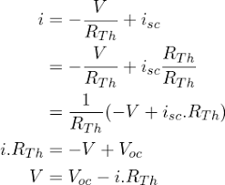
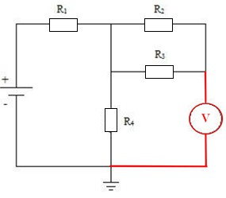
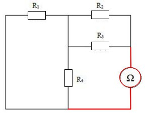
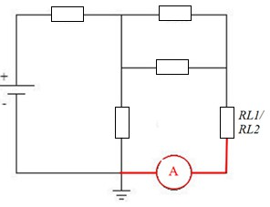
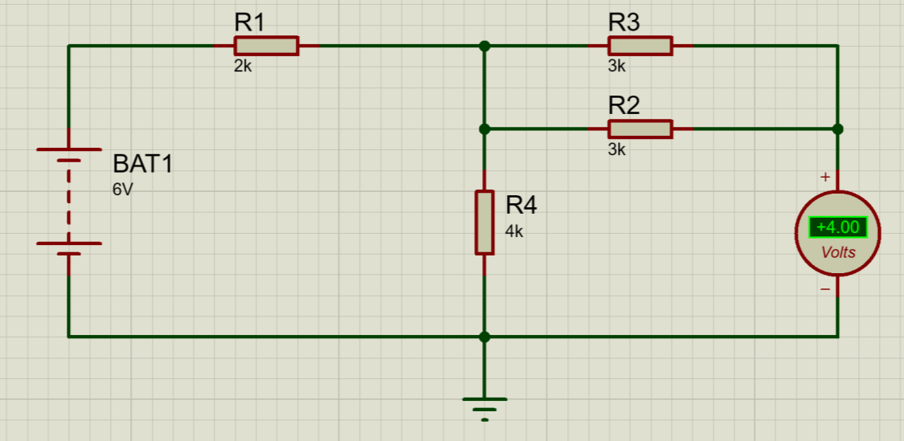
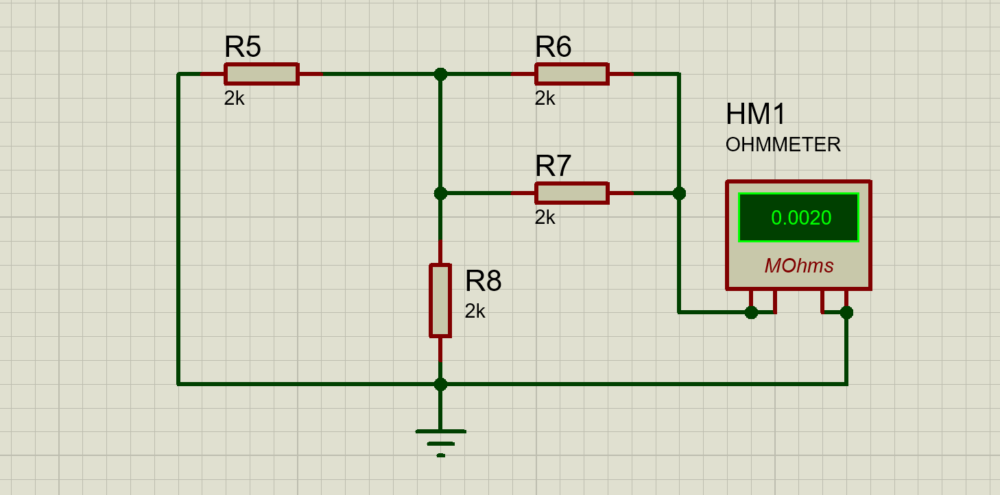
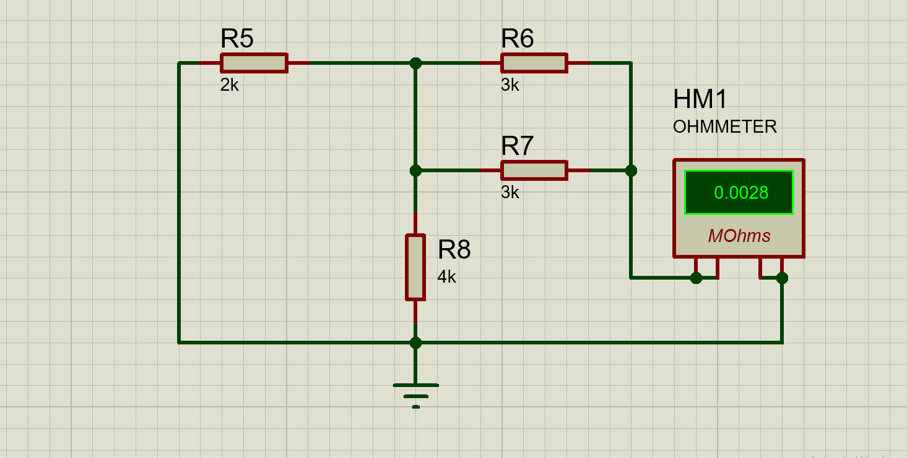
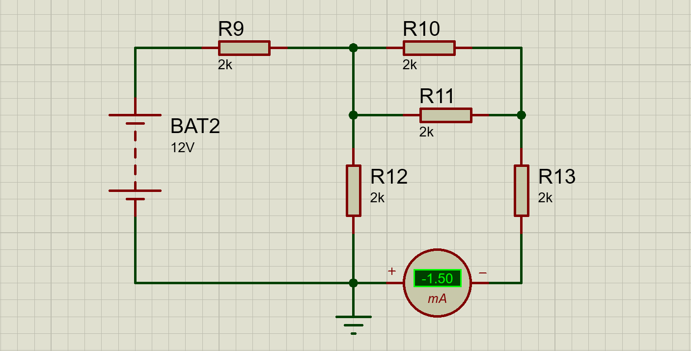
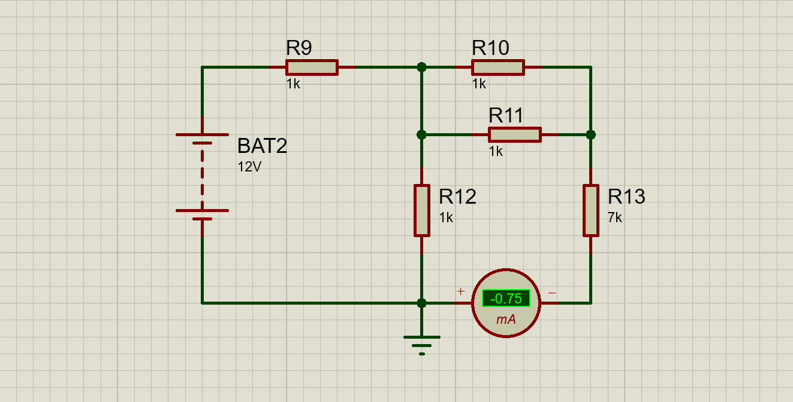

> {width="1.567567804024497in" height="1.6179166666666667in"}

# UNIVERSITAS ISLAM NEGERI SYARIF HIDAYATULLAH JAKARTA

> **LAPORAN PRAKTIKUM ELEKTRONIKA DASAR**
>
> **Nama : Amanda Putri 11220970000015 Hakim Afif Putra 11220970000031**
>
> **Kintan Alifia 11220970000025**

## Nomor Kelompok 10

## Fakultas : Sains dan Teknologi

## Jurusan : Fisika

## Nomor Percobaan : Percobaan 2 Rangkaian Dasar Resistor Teorema Thevenin Tanggal Percobaan : 21 Maret 2024

## Minggu ke- 3

> **Asisten : -**
>
> **Laporan Praktikum Rangkaian Dasar Resistor**

# TUJUAN PRAKTIKUM

1.  Memahami konsep dan penerapan hukum Thevenin dalam analisis rangkaian listrik.

2.  Mampu menghitung nilai hambatan ekivalen (Rth) pada rangkaian Thevenin.

3.  Mampu mengidentifikasi arus dan tegangan yang dihasilkan pada rangkaian dengan memperhatikan tegangan jatuh pada resistor.

4.  Mampu menentukan nilai hambatan tetap dan variasi pada rangkaian Thevenin.

5.  Mampu menghitung nilai tegangan Thevenin (Vth), resistansi Thevenin (Rth), dan arus beban (IL) pada suatu rangkaian menggunakan teorema Thevenin.

# DASAR TEORI

> {width="1.1018514873140857in" height="0.5664271653543307in"}Resistor adalah komponen elektronika berjenis pasif yang mempunyai sifat menghambat arus listrik. Satuan nilai dari resistor adalah ohm, biasa disimbolkan (Ω). Dalam beberapa rangkaian, resistor ditunjukkan sebagai berikut:
>
> *Gambar 1. Simbol resistor*
>
> Dalam beberapa percobaan seperti, Hukum Ohm, Hukum Kirchoff dan Teorema Thivenin, resistor digunakan sebagai komponen utama. Setiap percobaan terdapat tujuan yang berbeda. Resistor merupakan salah satu komponen yang paling sering ditemukan dalam Rangkaian Elektronika.^1^
>
> Teorema Thevenin adalah salah satu teori elektronika atau alat analisis yang menyederhanakan suatu rangkaian rumit menjadi suatu rangkaian sederhana dengan cara membuat suatu rangkaian pengganti yang berupa sumber tegangan yang dihubungkan secara seri dengan sebuah resistansi yang ekivalen. Teorema Thevenin ini sangat bermanfaat apabila diaplikasikan pada analisis rangkaian yang berkaitan dengan daya atau sistem baterai dan rangkaian interkoneksi yang dapat mempengaruhi satu rangkaian dengan rangkaian lainnya. Teorema Thevenin ini ditemukan oleh seorang insinyur yang berasal dari Perancis yaitu *M.L. Thevenin.^2^*
>
> Teorema Thevenin menyatakan bahwa: "Rangkaian linear dua terminal dapat disederhanakan menjadi rangkaian yang terdiri dari sebuah sumber tegangan V~TH~ terhubung seri dengan resistansi ekuivalen R~TH~ di antara dua terminal yang dianalisa." Tujuan utama teorema ini adalah untuk menyederhanakan analisa rangkaian yaitu untuk membuat rangkaian pengganti berupa sumber tegangan terhubung seri dengan resistansi
>
> 1 (Priyambodo, 2023)
>
> 2 (Nugraha, 2019)
>
> ekuivalennya.^3^
>
> Rumus dari Teorema Thevenin, yaitu sebagai berikut:

{width="2.1097648731408576in" height="1.7339577865266842in"}

> V~TH~ merupakan tegangan terbuka yang ada pada ujung terbuka rangkaian asli, sedangkan R~TH~ merupakan resistansi/impedansi antara ujung terbuka rangkaian asli, dimana semua sumber internal dibuat berharga nol (sumber tegangan diganti short circuit, sumber arus diganti open circuit).^4^

# METODOLOGI PERCOBAAN

## Percobaan 1 Mengukur Vth

1.  **Alat dan Bahan**

    1.  Resistor 4 buah

    2.  Potensiometer 1 buah

    3.  Power supply 0-12 Vdc 1 buah

    4.  Terminal Ground 1 buah

## Prosedur Percobaan

1.  Menyusun rangkaian seperti pada gambar dibawah.

> {width="2.259354768153981in" height="1.97125in"}
>
> Gambar 2. Rangkaian Mengukur Vth

2.  Memberikan variasi tegangan input sebesar 6 V - 12 V dengan hambatan sama kemudian mencatatnya tegangan yang dihasilkan pada voltmeter.

3.  Memberikan tegangan input sebesar 6V - 12V dengan hambatan berbeda kemudian mencatatnya tegangan yang dihasilkan pada voltmeter.

> 3 (Electrical, 2019)
>
> 4 (Jumadi, 2010)

## Percobaan 2 Mengukur Rth

1.  **Alat dan Bahan**

    1.  Resistor 4 buah

    2.  Ohmmeter 1 buah

## Prosedur Percobaan

1.  Menyusun rangkaian seperti pada gambar dibawah

> {width="2.513108048993876in" height="1.96875in"}
>
> Gambar 3. Rangkaian Mengukur Rth

2.  Mencatat resistansi yang didapatkan pada Ohmmeter dengan hambatan yang sama.

3.  Mencatat resistansi yang didapatkan pada Ohmmeter dengan hambatan yang berbeda.

## Percobaan 3 Mengukukur IL

1.  **Alat dan Bahan**

    1.  Resistor 5 buah

    2.  Ohmmeter 1 buah

## Prosedur Percobaan

1.  Menyusun rangkaian seperti pada gambar dibawah

> {width="2.56165791776028in" height="1.962603893263342in"}
>
> Gambar 4. Rangkaian Mengukur Rth

2.  Memberikan variasi tegangan input sebesar 6 V - 12 V dengan hambatan tetap kemudian mencatat arus listrik yang dihasilkan pada amperemeter.

3.  Memberikan tegangan input sebesar 6V - 12V dengan hambatan IL bervariasi (1k-7k) kemudian mencatat arus listrik yang dihasilkan pada amperemeter.

# HASIL & PEMBAHASAN

## Data Percobaan

1.  **Percobaan 1 Rangkaian Thevenin Mengukur Vth**

> **Tegangan Variasi (6-12V); Hambatan Tetap (2K)**

+-------+----------------------+---------------------+
| > No. | > Tegangan Input (𝑉) | Tegangan Output (𝑉) |
+=======+======================+=====================+
| > 1   | > 6                  | 3                   |
+-------+----------------------+---------------------+
| > 2   | > 7                  | 3,5                 |
+-------+----------------------+---------------------+
| > 3   | > 8                  | 4                   |
+-------+----------------------+---------------------+
| > 4   | > 9                  | 4,5                 |
+-------+----------------------+---------------------+
| > 5   | > 10                 | 5                   |
+-------+----------------------+---------------------+
| > 6   | > 11                 | 5,5                 |
+-------+----------------------+---------------------+
| > 7   | > 12                 | 6                   |
+-------+----------------------+---------------------+

> **Tegangan Variasi (6-12V); Hambatan Variasi (2K, 3K, 3K, 4K)**

+-------+----------------------+---------------------+
| > No. | > Tegangan Input (𝑉) | Tegangan Output (𝑉) |
+=======+======================+=====================+
| > 1   | > 6                  | 4                   |
+-------+----------------------+---------------------+
| > 2   | > 7                  | 4,67                |
+-------+----------------------+---------------------+
| > 3   | > 8                  | 5,33                |
+-------+----------------------+---------------------+
| > 4   | > 9                  | 6                   |
+-------+----------------------+---------------------+
| > 5   | > 10                 | 6,67                |
+-------+----------------------+---------------------+
| > 6   | > 11                 | 7,33                |
+-------+----------------------+---------------------+
| > 7   | > 12                 | 8                   |
+-------+----------------------+---------------------+

## Percobaan 2 Rangkaian Thevenin Mengukur Rth

> **Hambatan Tetap (2K)**

+-----+----------------+----------------+
| No. | > Hambatan (R) | Ohmmeter (𝑚Ω)  |
+=====+================+================+
| > 1 | > 2            | 0,0020         |
+-----+----------------+----------------+

> **Hambatan Variasi (2K. 3K. 3K, 4K)**

+-------+------------------+----------------+
| > No. | > Hambatan (R)   | Ohmmeter (𝑚Ω)  |
+=======+==================+================+
| > 1   | > 2K, 3K, 3K, 4K | 0,0028         |
+-------+------------------+----------------+

## Percobaan 3 Rangkaian Thevenin Mengukur IL

> **Tegangan Variasi (6-12V); Hambatan Tetap (2K)**

+-------+----------------------+------------------+
| > No. | > Tegangan Input (𝑉) | Amperemeter (𝑚𝐴) |
+=======+======================+==================+
| > 1   | > 6                  | 0,75             |
+-------+----------------------+------------------+
| > 2   | > 7                  | 0,87             |
+-------+----------------------+------------------+
| > 3   | > 8                  | 1                |
+-------+----------------------+------------------+
| > 4   | > 9                  | 1,12             |
+-------+----------------------+------------------+
| > 5   | > 10                 | 1,25             |
+-------+----------------------+------------------+
| > 6   | > 11                 | 1,37             |
+-------+----------------------+------------------+
| > 7   | > 12                 | 1,5              |
+-------+----------------------+------------------+

> **Tegangan Tetap (12V); Hambatan Variasi (1k-7k)**

+-------+----------------+------------------+
| > No. | > Hambatan (𝑅) | Amperemeter (𝑚𝐴) |
+=======+================+==================+
| > 1   | > 1k           | 3                |
+-------+----------------+------------------+
| > 2   | > 2k           | 2                |
+-------+----------------+------------------+
| > 3   | > 3k           | 1,5              |
+-------+----------------+------------------+
| > 4   | > 4k           | 1,2              |
+-------+----------------+------------------+
| > 5   | > 5k           | 1                |
+-------+----------------+------------------+
| > 6   | > 6k           | 0,86             |
+-------+----------------+------------------+
| > 7   | > 7k           | 0,75             |
+-------+----------------+------------------+

## Pengolahan data

- **Mengukur Vth**

> **- Menghitung Vth pada R tetap**
>
> 𝑹𝟒
>
> **- Menghitung Kesalahan Literatur**
>
> 𝑲𝑳 = \|𝑋𝑏𝑎𝑟− 𝑋𝑙𝑖𝑡\| 𝒙𝟏𝟎𝟎%
>
> 𝑽𝒕𝒉 =
>
> 𝒙 𝑽 𝒊𝒏𝒑𝒖𝒕
>
> 𝑹𝟏 + 𝑹𝟒
>
> 𝑋𝑙𝑖𝑡
>
> **- V input = 6 volt**
>
> 2000
>
> 𝑉𝑡ℎ =
>
> 2000 + 2000
>
> **- V input = 7 volt**
>
> 2000
>
> 𝑉𝑡ℎ =
>
> 2000 + 2000
>
> **- V input = 8 volt**
>
> 2000
>
> 𝑥6 = 3𝑉
>
> 𝑥7 = 3,5𝑉

- **V input = 6 volt**

> 3 − 3
>
> 𝐾𝐿 = \| \| 𝑥100% = 0% 3

- **V input = 7 volt**

> 3,5 − 3,5
>
> 𝐾𝐿 = \| \| 𝑥100% = 0% 3,5

- **V input = 8 volt**

> 4 − 4
>
> 𝑉𝑡ℎ = 𝑥8 = 4𝑉 2000 + 2000
>
> 𝐾𝐿 = \|
>
> \| 𝑥100% = 0%
>
> 4

- **V input = 9 volt**

> 2000

- **V input = 9 volt**

> 4,5 − 4,5
>
> 𝑉𝑡ℎ = 𝑥9 = 4,5𝑉 2000 + 2000
>
> 𝐾𝐿 = \|
>
> \| 𝑥100% = 0%
>
> 4,5

- **V input = 10 volt**

> 2000

- **V input = 10 volt**

> 5 − 5
>
> 𝑉𝑡ℎ = 𝑥10 = 5𝑉 2000 + 2000
>
> 𝐾𝐿 = \|
>
> \| 𝑥100% = 0%
>
> 5

- **V input = 11 volt**

> 2000

- **V input = 11 volt**

> 5,5 − 5,5
>
> 𝑉𝑡ℎ = 𝑥11 = 5,5𝑉 2000 + 2000
>
> 𝐾𝐿 = \|
>
> \| 𝑥100% = 0%
>
> 5,5

- **V input = 12 Volt**

- **V input = 12 volt**

> 2000
>
> 𝑉𝑡ℎ =
>
> 2000 + 2000
>
> 𝑥12 = 6𝑉
>
> 6 − 6
>
> 𝐾𝐿 = \| \| 𝑥100% = 0% 6

- **Menghitung Vth pada R Variasi**

𝑹𝟒

- **Menghitung Kesalahan Literatur**

> 𝑽𝒕𝒉 =
>
> 𝒙 𝑽 𝒊𝒏𝒑𝒖𝒕
>
> 𝑹𝟏 + 𝑹𝟒
>
> 𝑲𝒍

- **V input = 6 volt**

> 4000
>
> 𝑽𝒉𝒊𝒕𝒖𝒏𝒈 − 𝑽𝒕𝒂𝒃𝒆𝒍
>
> = \| \| 𝒙𝟏𝟎𝟎%
>
> 𝑽𝒕𝒂𝒃𝒆𝒍
>
> 𝑉𝑡ℎ = 𝑥6 = 4𝑉 2000 + 4000

- **V input = 7 volt**

- **V input = 6 volt**

> 4,8 − 4,8
>
> 𝑉𝑡ℎ =
>
> 4000
>
> 𝑥7 = 4,67𝑉
>
> 𝐾𝐿 = \|
>
> \| 𝑥100% = 0%
>
> 4,8
>
> 2000 + 4000

- **V input = 8 volt**

- **V input = 7 volt**

> 5,6 − 5,6
>
> 𝑉𝑡ℎ =
>
> 4000
>
> 𝑥8 = 5,33𝑉
>
> 𝐾𝐿 = \|
>
> \| 𝑥100% = 0%
>
> 5,6
>
> 2000 + 4000

- **V input = 9 volt**

- **V input = 8 volt**

> 6,4 − 6,4
>
> 4000
>
> 𝑉𝑡ℎ =
>
> 𝑥9 = 6𝑉
>
> 𝐾𝐿 = \|
>
> \| 𝑥100% = 0%
>
> 6,4
>
> 2000 + 4000

- **V input = 10 volt**

- **V input = 9 volt**

> 7,2 − 7,2
>
> 4000
>
> 𝑉𝑡ℎ =
>
> 𝑥10 = 6,67𝑉
>
> 𝐾𝐿 = \|
>
> \| 𝑥100% = 0%
>
> 7,2
>
> 2000 + 4000

- **V input = 11 volt**

- **V input = 10 volt**

> 8,0 − 8,0
>
> 𝑉𝑡ℎ =
>
> 4000
>
> 𝑥11 = 7,33𝑉
>
> 𝐾𝐿 = \|
>
> 8,0
>
> \| 𝑥100% = 0%
>
> 2000 + 4000

- **V input = 12 Volt**

- **V input = 11 volt**

> 8,8 − 8,8
>
> 4000
>
> 𝑉𝑡ℎ =
>
> 𝑥12 = 8𝑉
>
> 𝐾𝐿 = \|
>
> \| 𝑥100% = 0%
>
> 8,8
>
> 2000 + 4000
>
> **- V input = 12 volt**

9,6 − 9,6

𝐾𝐿 = \|

> 9,6
>
> \| 𝑥100% = 0%

- **Menghitung R~th~**

<!-- -->

- **R Tetap (1k)**

<!-- -->

- **Kesalahan Relatif**

Rth

> = ( 𝑅₆.𝑅₇ ) + ( 𝑅₅.𝑅₈ )
>
> KL = \|

𝑋𝑏𝑎𝑟− 𝑋𝑙𝑖𝑡

\| X 100%

𝑅₆+𝑅₇

> 𝑅₅+𝑅₈

𝑋𝑙𝑖𝑡

> Rth = ( 2000.2000 ) + ( 2000.2000 )
>
> KL = \|2000−2000\| X 100%
>
> 2000+2000
>
> 2000+2000

2000

> Rth = (2000000) + (2000000)
>
> KL = \| 0
>
> \| X 100%
>
> 2000
>
> R~th~ = 500 + 500
>
> R~th~ = 2000Ω
>
> 2000
>
> 2000
>
> KL = 0 %
>
> **- R Variasi (1k, 2k, 3k, 4k)**
>
> Rth = ( [𝑅₆.𝑅₇]{.underline} ) + ( [𝑅₅.𝑅₈]{.underline} )
>
> **Kesalahan Relatif**
>
> KL = \|𝑋𝑏𝑎𝑟− 𝑋𝑙𝑖𝑡\| X 100%

𝑅₆+𝑅₇

> 𝑅₅+𝑅₈

𝑋𝑙𝑖𝑡

> Rth = ( [3000.3000]{.underline} ) + ( [2000.4000]{.underline} )
>
> KL = \|[2833−2833]{.underline}\| X 100%
>
> 3000+3000
>
> 2000+4000

2833

> Rth = ([9000000]{.underline}) + ([8000000]{.underline})
>
> [0]{.underline}

KL = \|

> 6000
>
> R~th~ = 1500+ 1333
>
> R~th~ = 2833Ω
>
> 6000
>
> 2833
>
> KL = 0%

- **Menghitung IL**

> **- V Variasi (6-12 V); R tetap (2k)**
>
> 𝐼𝐿 = 𝑉𝑡ℎ =
>
> 𝑅𝑡ℎ+𝑅𝑙

- **Menghitung Kesalahan Literatur**

> 𝑋𝑏𝑎𝑟− 𝑋𝑙𝑖𝑡
>
> **- V input = 6V**

3,00

> 𝑲𝑳 = \|
>
> 𝑋𝑙𝑖𝑡
>
> \| 𝒙𝟏𝟎𝟎%
>
> 𝐼𝐿 = = 0,00075𝐴 2000 + 2000

- **V input = 7V**

> 3,50
>
> 𝐼𝐿 = = 0,00087𝐴 2000 + 2000

- **V input = 8V**

- **V input = 6 volt**

> 0,75 − 0,75
>
> 𝐾𝐿 = \| \| 𝑥100% = 0% 0,75

- **V input = 7 volt**

> 0,87 − 0,87
>
> 𝐾𝐿 = \| \| 𝑥100% = 0%
>
> 4,00

𝐼𝐿 =

> 2000 + 2000

- **V input = 9V**

> = 0,001𝐴
>
> 0,87

- **V input = 8 volt**

1 − 1

> 4,50
>
> 𝐼𝐿 =
>
> = 0,00112𝐴
>
> 𝐾𝐿 = \|
>
> \| 𝑥100% = 0%
>
> 1
>
> 2000 + 2000

- **V input = 10V**

- **V input = 9 volt**

> 1,12 − 1,12
>
> 5,00
>
> 𝐼𝐿 =
>
> = 0,00125𝐴
>
> 𝐾𝐿 = \|
>
> \| 𝑥100% = 0%
>
> 1,12
>
> 2000 + 2000

- **V input = 11V**

- **V input = 10 volt**

> 1,25 − 1,25
>
> 5,50
>
> 𝐼𝐿 =
>
> = 0,00137𝐴
>
> 𝐾𝐿 = \|
>
> \| 𝑥100% = 0%
>
> 1,25
>
> 2000 + 2000

- **V input = 12V**

> 6,00

𝐼𝐿 =

> 2000 + 2000
>
> = 0,0015𝐴

- **V input = 11 volt**

> 1,37 − 1,37
>
> 𝐾𝐿 = \| \| 𝑥100% = 0% 1,37

- **V input = 12 volt**

> 1,5 − 1,5

𝐾𝐿 = \|

> 1,5
>
> \| 𝑥100% = 0%

- **Menghitung IL**

<!-- -->

- **V Tetap (12V); R Variasi (1k-7k)**

> 𝐼𝐿 = 𝑉𝑡ℎ =
>
> 𝑅𝑡ℎ+𝑅𝑙

- **Menghitung Kesalahan Literatur**

> 𝑲𝑳 = \|𝑋𝑏𝑎𝑟− 𝑋𝑙𝑖𝑡\| 𝒙𝟏𝟎𝟎%

𝑋𝑙𝑖𝑡

- **R input = 1k**

- **R input = 1k**

> 6,00

𝐼𝐿 =

> 1000 + 1000
>
> = 0,00300𝐴
>
> 𝐾𝐿 = \|

3,00 − 3,00

> \| 𝑥100% = 0%
>
> 3,00

- **R input = 2k**

> 6,00

𝐼𝐿 =

> 1000 + 2000

- **R input = 3k**

> 6,00

𝐼𝐿 =

> 1000 + 3000

- **R input = 4k**

> 6,00

𝐼𝐿 =

> = 0,00200𝐴
>
> = 0,00150𝐴
>
> = 0,00120𝐴

- **R input = 2k**

> 2,00 − 2,00
>
> 𝐾𝐿 = \| \| 𝑥100% = 0% 2,00

- **R input = 3k**

> 1,50 − 1,50
>
> 𝐾𝐿 = \| \| 𝑥100% = 0% 1,50

- **R input = 4k**

> 1,20 − 1,20
>
> 1000 + 4000

𝐾𝐿 = \|

> \| 𝑥100% = 0%
>
> 1,20

- **R input = 5k**

> 6,00

𝐼𝐿 =

> 1000 + 5000

- **R input = 6k**

> 6,00
>
> = 0,00100𝐴

- **R input = 5k**

> 1,00 − 1,00

𝐾𝐿 = \|

> 1,00

- **R input = 6k**

\| 𝑥100% = 0%

> 𝐼𝐿 = = 0,00086𝐴 1000 + 6000

- **R input = 7k**

> 0,86 − 0,86
>
> 𝐾𝐿 = \| \| 𝑥100% = 0% 0,86
>
> 6,00

𝐼𝐿 =

> 1000 + 7000

## Grafik

> = 0,00075𝐴
>
> **- R input = 7k**
>
> 0,75 − 0,75
>
> 𝐾𝐿 = \| \| 𝑥100% = 0% 0,75
>
> Voltmeter (V)
>
> Voltmeter (V)
>
> Amperemeter (mA)
>
> Amperemeter (mA)

## Pembahasan

> Dalam praktikum ini, kami melakukan pengukuran dan analisis menggunakan rangkaian resistor berdasarkan Teorema Thevenin. Kami melakukan tiga percobaan yang berbeda.
>
> Percobaan pertama adalah mengukur Tegangan Thevenin (Vth) dengan memberikan tegangan input antara 6V hingga 12V dan mencatat tegangan yang dihasilkan. Dalam dua kali pengambilan tipe data, pertama dengan resistor tetap dan kedua dengan resistor bervariasi, kami mencatat nilai tegangan yang dihasilkan pada setiap nilai tegangan input. Hasil pengukuran kami menunjukkan bahwa kesalahan literatur dalam perhitungan kami adalah 0%.
>
> Percobaan kedua adalah mengukur Hambatan Thevenin (Rth) dengan resistor tetap sebesar 2K dan resistor bervariasi. Kami menghasilkan nilai resistansi untuk masing-masing kasus dan menemukan bahwa kesalahan literatur dalam perhitungan kami adalah 0%.
>
> Percobaan ketiga melibatkan pengukuran Arus Beban (IL) dengan variasi tegangan input (6V hingga 12V) dan resistor tetap, serta variasi resistor (1K hingga 7K) dengan tegangan tetap (12V). Hasil perhitungan kami menunjukkan bahwa kesalahan literatur dalam semua kasus adalah 0%.
>
> Dari hasil percobaan tersebut, kami dapat menyimpulkan bahwa pengukuran kami sesuai dengan teori yang ada, dengan kesalahan yang sangat kecil. Hal ini menunjukkan bahwa Teorema Thevenin dapat digunakan secara efektif untuk menyederhanakan dan menganalisis rangkaian kompleks.

# KESIMPULAN

1.  Percobaan ini dilakukan untuk mendapatkan nilai Tegangan rangkaian terbuka (Vth), Resistansi rangkaian terbuka (Rth), dan Arus pada beban (IL) berdasarkan Teorema Thevenin. Dimana Teorema Thevenin merupakan teori yang merubah rangkaian linear menjadi rangkaian sederhana yang terdiri dari satu tegangan tunggal dan satu resistor yang terhubung secara seri.

2.  Didapatkan nilai Tegangan rangkaian terbuka (Vth) saat tegangan input 6V sebesar 3 Volt saat tegangan input 12V sebesar 6 Volt. Nilai Resistansi rangkaian terbuka (Rth) sebesar 2833 Ω. Dan nilai Arus pada beban (IL) saat tegangan input 6V sebesar 0,75 𝑥 10^−3^ 𝐴 saat tegangan input 12V sebesar 1,5 𝑥 10^−3^ 𝐴.

3.  Dihasilkan besar Kesalahan Literatur (KL) 0% untuk semua variasi atau percobaan pada praktikum ini yang membuktikan bahwa Teorema Thevenin bekerja pada rangkaian.

# REFERENSI

> \[1.\] Electrical, W. (2019). *Pengertian dan Rumus Teorema Thevenin*. \[2.\] Jumadi. (2010). *Praktikum Analisis Rangkaian Listrik.*
>
> \[3.\] Nugraha, A. T. (2019, September 23). *Pengertian Teorema Thevenin dan Cara Perhitungannya*.
>
> \[4.\] Priyambodo, W. (2023). *BUKU PANDUAN PRAKTIKUM ELEKTRONIKA DASAR.*
>
> Ciputat: PLT UIN Syarif Hidayatullah Jakarta.

# LAMPIRAN

{width="5.629025590551181in" height="2.81in"}

> Gambar 5. Rangkaian Mengukur Vth; Tegangan Variasi (6-12V); Hambatan Tetap (2K)

{width="5.624890638670166in" height="2.745in"}

> Gambar 6. Rangkaian Mengukur Vth; Tegangan Variasi (6-12V); Hambatan Variasi (2k, 3k,3k,4k)
>
> {width="5.624331802274716in" height="2.7865616797900263in"}
>
> Gambar 7. Rangkaian Mengukur Rth; Hambatan Tetap (2k)

{width="5.647826990376203in" height="2.8597911198600174in"}

> Gambar 8. Rangkaian Mengukur Rth; Hambatan Variasi (2k, 3k,3k,4k)

{width="5.569029965004375in" height="2.8302077865266844in"}

> Gambar 9. Rangkaian Mengukur IL; Tegangan Variasi (6-12V); Hambatan Tetap (2K)
>
> {width="5.648203193350831in" height="2.8742705599300087in"}
>
> Gambar 10. Rangkaian Mengukur IL; Tegangan Tetap (12V); Hambatan Variasi (1k-7k)
