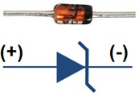
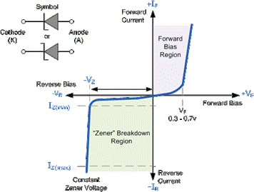
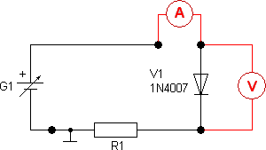
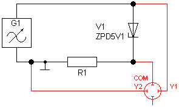
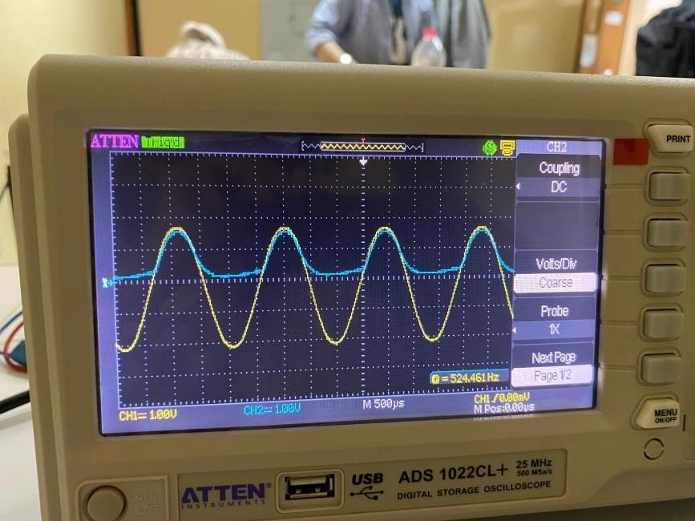
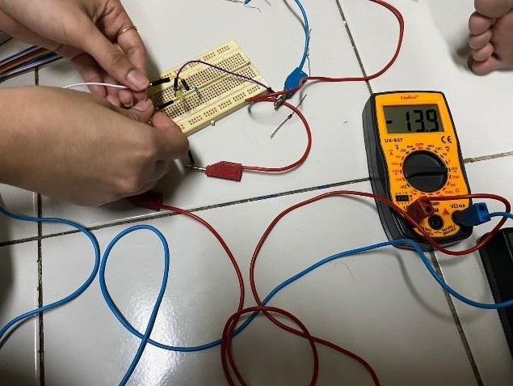
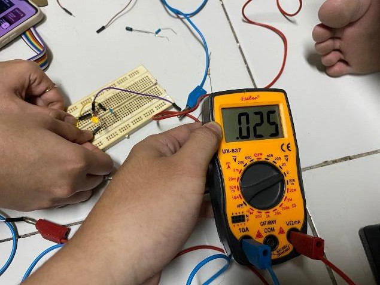
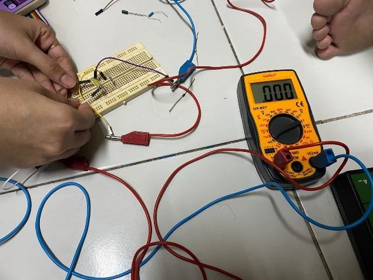
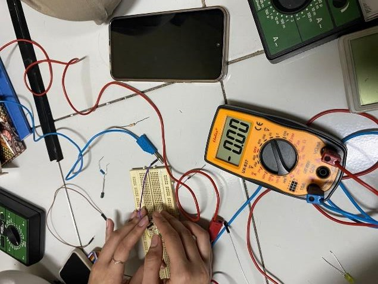
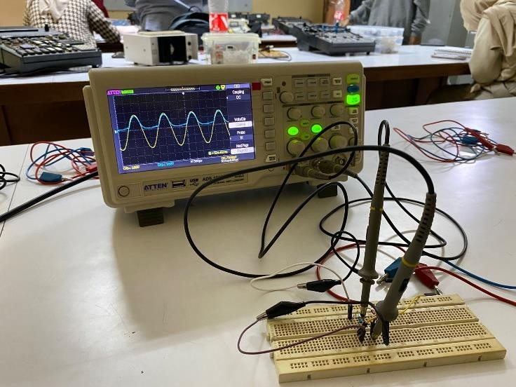

> {width="1.567567804024497in" height="1.6179166666666667in"}

# UNIVERSITAS ISLAM NEGERI SYARIF HIDAYATULLAH JAKARTA

> **LAPORAN PRAKTIKUM ELEKTRONIKA DASAR**

+---------------------+-------------------------+----------------+
| > Nama              | > : Amanda Putri        | 11220970000015 |
+:====================+:========================+===============:+
|                     | > Hakim Afif Putra      | 11220970000031 |
+---------------------+-------------------------+----------------+
|                     | > Kintan Alifia         | 11220970000025 |
+---------------------+-------------------------+----------------+
| > Nomor Kelompok    | > : 11                  |                |
+---------------------+-------------------------+----------------+
| > Fakultas          | > : Sains dan Teknologi |                |
+---------------------+-------------------------+----------------+
| > Jurusan           | > : Fisika              |                |
+---------------------+-------------------------+----------------+
| > Nomor Percobaan   | > : Percobaan 4         |                |
+---------------------+-------------------------+----------------+
| > Nama percobaan    | > : Karakteristik Dioda |                |
+---------------------+-------------------------+----------------+
| > Tanggal Percobaan | > : 16 Mei 2024         |                |
+---------------------+-------------------------+----------------+
| > Minggu ke-        | > : 4                   |                |
+---------------------+-------------------------+----------------+
| > Asisten           | > : -                   |                |
+---------------------+-------------------------+----------------+

# TUJUAN PRAKTIKUM

1.  Menentukan hubungan antara tegangan input dioda zioner dengan arus yang dihasilkan pada suatu rangkaian.

2.  Mempelajari karakteristik dioda zioner pada suatu rangkaian dengan Osiloskop.

# DASAR TEORI

> {width="1.8020833333333333in" height="1.2395833333333333in"}**Dioda zener** merupakan tulang punggung regulator tegangan (Kleemann et al. 2010). Keberadaan diode zener akan mempermudah pemrosesan isyarat analog. Namun sayangnya, badan zener kebanyakan dibangun dari bahan mengkilap sehingga label sulit dibaca atau hilang terkelupas. Akibatnya zener sering disalah pasangkan sebagai diode penyearah kecil. Peran zener pun tak lupa masih berperan dalam rangkaian. Ketika tegangan membesar, breakdown terjadi. Akibatnya rangkaian tidak dapat berfungsi seperti yang diharapkan (Istichoroh and Prihanto 2013). Untuk itu, keberadaan tester yang dapat mengetahui kelayakan dan nilai zener sangat diperlukan.
>
> *Gambar 1: Dioda zener:*
>
> Diode zener sangat tidak layak jika digunakan sebagai penyearah. Diode zener bekerja pada tegangan breakdown. Sifat ini sangat diperlukan pada regulator tegangan. Adanya kelebihan tegangan pencatu balik diode zener akan dibenamkan. Sementara tegangan pada ujung katoda diode zener bertahan pada tegangan zener. Arus yang melewati terbatas pada kapasitas diode zener yang diekspresikan sebagai daya diode zener dalam satuan watt. Namun daya yang kecil bukanlah penghalang bagi diode zener untuk menghasilkan regulator tegangan berarus besar (Istichoroh and Prihanto 2013).
>
> **Transistor bipolar** maupun **MOSFET** sering diaplikasikan bersama diode zener untuk mendapatkan regulator tegangan ber-arus besar (Horowitz and Hill 2015). Adanya arus yang besar dapat menyebabkan self-heating pada diode zener. Kenaikan suhu pada diode zener dapat menyebabkan tegangan diode zener turun dari nilai yang tercantum pada labelnya. Untuk itu minimalisasi arus yang melintas pada diode zener perlu dilakukan.
>
> **Tegangan kerja zener** sangat beragam. Diode zener di pasaran umumnya dapat dijumpai dari 1,2 V sampai 100 V. Sedangkan diode penyearah yang banyak dijumpai di pasaran memiliki tegangan breakdown 50 V. Tegangan breakdown 50 Volt dapat dijumpai
>
> pada diode tipe 1N4001 atau 1N4148. Diode 1N4148 memiliki badan berlapis kaca yang seringkali sulit dibedakan dari diode zener (Bates and Malvino 2015). Dengan pertimbangan ini, diode zener tester yang akan dibangun ini masih dibatasi untuk zener 45 V maksimal. Tegangan diode zener yang besar dapat diakuisisi dari ujung anoda dan katoda diode zener itu. Besarnya tegangan adalah kendala bagi mikrokontroler yang hanya memiliki wilayah operasi 0-5 Volt. Untuk itu tegangan eksiter diode zener yang mencapai 50 Volt perlu diturunkan dengan pembagi tegangan untuk mencapai 5 Volt saja. Jika lebih, mikrokontroler akan rusak permanen.
>
> **Karakteristik Dioda Zener**, Dioda Zener beroperasi seperti dioda normal saat berada dalam mode bias maju, dan memiliki voltase turn-on antara 0,3 dan 0,7 V. Namun, bila terhubung dalam mode terbalik, yang biasa dilakukan pada sebagian besar aplikasinya, sebuah Arus kebocoran kecil bisa mengalir. Seiring meningkatnya tegangan balik ke tegangan pemecah yang telah ditentukan sebelumnya (Vz), arus mulai mengalir melalui dioda. Arus meningkat sampai maksimum, yang ditentukan oleh resistor seri, setelah itu stabil dan tetap konstan pada rentang tegangan terapan yang luas.
>
> {width="3.723053368328959in" height="2.8020833333333335in"}
>
> *Gambar 2: Karakteristik I-V Dioda zener:*
>
> Dioda Zener digunakan dalam mode "reverse bias" atau *reverse breakdown*, yaitu anoda dioda terhubung ke suplai negatif. Dari kurva karakteristik I-V di atas, kita dapat melihat bahwa dioda zener memiliki suatu daerah dalam karakteristik bias terbaliknya hampir dengan tegangan negatif konstan, terlepas dari nilai arus yang mengalir melalui dioda dan tetap hampir konstan meski dengan perubahan besar pada arus yang melewati. Selama arus dioda zener tetap berada di antara arus pemecah IZ (min) dan nilai arus maksimum IZ (maks). Kemampuan mengendalikan diri ini dapat digunakan untuk mengatur atau menstabilkan sumber tegangan
>
> terhadap variasi pasokan atau beban. Kenyataan bahwa tegangan yang melewati dioda di "breakdown region" hampir konstan menjadi karakteristik penting dioda zener karena dapat digunakan pada jenis aplikasi pengatur voltase yang paling sederhana.

# METODOLOGI PERCOBAAN

## Percobaan 1 Mengukur Tegangan dan Arus

1.  **Alat dan Bahan**

    1.  Papan Roti 1 buah

    2.  Dioda Zioner 1 buah

    3.  Multimeter 1 buah

    4.  Lampu 1 buah

    5.  Resistor 1 buah

    6.  Kabel Penghubung & Jumper 2 pasang

## Prosedur Percobaan

1.  Menyusun rangkaian seperti pada gambar dibawah.

{width="3.376042213473316in" height="1.9012489063867017in"}

> Gambar 3. Rangkaian Dioda Zioner

2.  Memvariasikan\\tegangan input dari 0 sampai 10 volt dengan forward bias, kemudian mencatat perubahan tegangan dan arus untuk setiap perubahan tegangan input.

3.  Memvariasikan\\tegangan input dari 0 sampai 10 volt dengan reverse bias, kemudian mencatat perubahan tegangan dan arus untuk setiap perubahan tegangan input

## Percobaan Meneliti Karakteristik Dioda Ziner

1.  **Alat dan Bahan**

<!-- -->

1.  Osiloskop Digital 1 buah

2.  Dioda Zioner 1 buah

3.  Lampu 1 buah

4.  Resistor 1 buah

5.  Kabel Penghubung 2 pasang

6.  Jumper 2 pasang

## Prosedur Percobaan

1.  Menyusun rangkaian seperti pada gambar dibawah.

{width="3.5340846456692914in" height="2.120311679790026in"}

> Gambar 4. Rangkaian Dioda dengan Osiloskop

2.  Membandingkan tegangan channel Y1 dan Y2 dari osiloskop

# HASIL & PEMBAHASAN

## Data Percobaan dan Pengolahan Data

1.  **Percobaan 1 Mengukur Tegangan dan Arus Resistor**

  ---------------
  **R1**
  ---------------
  1K𝛺

  1000𝛺
  ---------------

## Data Percobaan 1

+----------------------------------------------------------+
| > Tegangan Input 0V sampai 10V (Forward Bias)            |
+:=====================+=================+=================+
| > Tegangan Input (V) | Arus (mA)       | V dioda         |
+----------------------+-----------------+-----------------+
| 0                    | 0,01            | 0               |
+----------------------+-----------------+-----------------+
| 1                    | 0,95            | 0,06            |
+----------------------+-----------------+-----------------+
| 2                    | 1,72            | 0,1             |
+----------------------+-----------------+-----------------+
| 3                    | 1,85            | 0,17            |
+----------------------+-----------------+-----------------+
| 4                    | 2,15            | 0,2             |
+----------------------+-----------------+-----------------+

+------------------------------------------------------------+
| > Tegangan Input 0V sampai 10V (Forward Bias)              |
+======================+==================+==================+
| 5                    | 2.37             | 0,23             |
+----------------------+------------------+------------------+
| 6                    | 2,58             | 0,26             |
+----------------------+------------------+------------------+
| 7                    | 2,94             | 0,3              |
+----------------------+------------------+------------------+
| 8                    | 3,18             | 0,34             |
+----------------------+------------------+------------------+
| 9                    | 4,19             | 0,38             |
+----------------------+------------------+------------------+
| 10                   | 6,21             | 0,43             |
+----------------------+------------------+------------------+
| > Tegangan Input 0V sampai -10V (Reverse Bias)             |
+----------------------+------------------+------------------+
| > Tegangan Input (V) | Arus (mA)        | V dioda          |
+----------------------+------------------+------------------+
| 0                    | 0                | 0                |
+----------------------+------------------+------------------+
| 1                    | -0,03            | -0,07            |
+----------------------+------------------+------------------+
| 2                    | -0,09            | -0,58            |
+----------------------+------------------+------------------+
| 3                    | -0,13            | -1,84            |
+----------------------+------------------+------------------+
| 4                    | -0,15            | -2,83            |
+----------------------+------------------+------------------+
| 5                    | -0,21            | -3,21            |
+----------------------+------------------+------------------+
| 6                    | -0,27            | -4,68            |
+----------------------+------------------+------------------+
| 7                    | -0,33            | -5,7             |
+----------------------+------------------+------------------+
| 8                    | -0,39            | -6,33            |
+----------------------+------------------+------------------+
| 9                    | -0,47            | -7,49            |
+----------------------+------------------+------------------+
| 10                   | -0,55            | -8,22            |
+----------------------+------------------+------------------+

## Percobaan 2 Meneliti Karakteristik Dioda Ziner Resistor

  ---------------
  **R1**
  ---------------
  1K𝛺

  ---------------

> 1000𝛺

## Data Percobaan 2

+----------------+---------------+----------------+
| > **Komponen** | **Y1 (V)**    | > **Y2 (V)**   |
|                |               | >              |
|                | **Dioda**     | > **Resistor** |
+================+===============+================+
| Puncak         | 9,9849        | 9,4163         |
+----------------+---------------+----------------+
| > Lembah       | -9,9849       | -5,0345        |
+----------------+---------------+----------------+

2.  **Pengolahan Data**

    1.  **Percobaan 1 Mengukur Tegangan dan Arus Tabel Pengolahan Data**

- **Forward Bias**

> Untuk forward bias yakni pada tegangan input 0V sampai 10V dan tegangan breakdown dioda zener sebesar 5V:

+----------------------+------------+--------------+
| > Tegangan Input (V) | V lit      | V dioda      |
+======================+============+==============+
| 0                    | 0.5        | 0            |
+----------------------+------------+--------------+
| 1                    | 0.5        | 0,06         |
+----------------------+------------+--------------+
| 2                    | 0.5        | 0,1          |
+----------------------+------------+--------------+
| 3                    | 0.5        | 0,17         |
+----------------------+------------+--------------+
| 4                    | 0.5        | 0,2          |
+----------------------+------------+--------------+
| 5                    | 0.5        | 0,23         |
+----------------------+------------+--------------+
| 6                    | 0.5        | 0,26         |
+----------------------+------------+--------------+
| 7                    | 0.5        | 0,3          |
+----------------------+------------+--------------+
| 8                    | 0.5        | 0,34         |
+----------------------+------------+--------------+
| 9                    | 0.5        | 0,38         |
+----------------------+------------+--------------+
| 10                   | 0.5        | 0,43         |
+----------------------+------------+--------------+
| Jumlah                            | 2,47         |
+-----------------------------------+--------------+

## Rata-Rata Tegangan Dioda

𝑉̅̅𝐷̅̅ = ∑ 𝑉𝐷

> 𝑛
>
> 𝑉̅̅𝐷̅̅ = 2,47 = 0,247
>
> 10

## Kesalahan Literatur :

## 

> Xlit: 0,7 (berdasarkan dioda Ge)
>
> 𝑉̅̅𝐷̅̅ − 𝑋𝑙𝑖𝑡
>
> 𝐾𝑙 = \|
>
> 𝐾𝑙 = \|
>
> 𝑋𝑙𝑖𝑡 \| × 100%

0,247 − 0,7

> 0,7 \| × 100%
>
> 𝐾𝑙 = \|−0,6471\| × 100%
>
> 𝐾𝑙 = 64,71%
>
> V Dioda (v)

- **Reverse Bias**

> Sedangkan untuk reverse bias yakni pada tegangan input 0V sampai -10V dan tegangan breakdown dioda zener 5V, besar kuat arus dan tegangan yang melalui dioda yang terukur sangatlah kecil hingga mendekati nol:

+----------------------+---------+--------------+
| > Tegangan Input (V) | V lit   | V dioda      |
+======================+=========+==============+
| 0                    | -4      | 0            |
+----------------------+---------+--------------+
| -1                   | -4      | -0,07        |
+----------------------+---------+--------------+
| -2                   | -4      | -0,58        |
+----------------------+---------+--------------+
| -3                   | -4      | -1,84        |
+----------------------+---------+--------------+
| -4                   | -4      | -2,83        |
+----------------------+---------+--------------+
| -5                   | -4      | -3,21        |
+----------------------+---------+--------------+
| -6                   | -4      | -4,68        |
+----------------------+---------+--------------+

+------------+------------+--------------+
| -7         | -4         | -5,7         |
+============+============+==============+
| -8         | -4         | -6,33        |
+------------+------------+--------------+
| -9         | -4         | -7,49        |
+------------+------------+--------------+
| -10        | -4         | -8,22        |
+------------+------------+--------------+
| Jumlah                  | -40,95       |
+-------------------------+--------------+

## Rata-Rata Tegangan Dioda

> ∑ 𝑉𝐷
>
> 𝑉̅̅𝐷̅̅ = 𝑛
>
> 𝑉̅̅𝐷̅̅ = −40,95 = −4,095
>
> 10

## Kesalahan Literatur :

> Xlit: -4 (berdasarkan dioda Ge)
>
> 𝑉̅̅𝐷̅̅ − 𝑋𝑙𝑖𝑡
>
> 𝐾𝑙 = \|
>
> 𝐾𝑙 = \|
>
> 𝑋𝑙𝑖𝑡 \| × 100%

−4,095 − (−4)

> 0,7 \| × 100%
>
> V Dioda (v)
>
> 𝐾𝑙 = 13,57%

## Grafik Hasil Percobaan :

## 

1.  **Percobaan 2 Meneliti Karakteristik Dioda Ziner**

> Dari hasil data percobaan, maka kita dapat menentukan kesalahan literatur sebagai berikut:

## Dioda

- Channel Y1 Puncak

> Diketahui [𝑥]{.underline} = *9*,*9849*, 𝑥~𝑙𝑖𝑡~ = *10*, maka:
>
> [𝑥]{.underline} − 𝑥~𝑙𝑖𝑡~

𝐾𝐿~⬚~ = \|

> 𝑥𝑙𝑖𝑡
>
> \| × *100%*

𝐾𝐿~⬚~ = \|

- Channel Y1 Lembah

*9*,*9849* − *10*

> *10* \| × *100%* = *0*,*00151%*
>
> Diketahui [𝑥]{.underline} = −*9*,*9849*, 𝑥~𝑙𝑖𝑡~ = −*10* maka:
>
> [𝑥]{.underline} − 𝑥~𝑙𝑖𝑡~

𝐾𝐿~⬚~ = \|

> 𝑥𝑙𝑖𝑡
>
> \| × *100%*

## Resistor

> 𝐾𝐿~⬚~ = \|

−*9*,*9849* − (−*10*)

> \| × *100%* = *0*,*00151%*
>
> −*10*

- Channel Y2 Puncak

> Diketahui [𝑥]{.underline} = *9*,*4163*, 𝑥~𝑙𝑖𝑡~ = *9*,*4*, maka:
>
> [𝑥]{.underline} − 𝑥~𝑙𝑖𝑡~

𝐾𝐿~⬚~ = \|

> 𝑥𝑙𝑖𝑡
>
> \| × *100%*
>
> *9*,*4163* − *9*,*4*
>
> 𝐾𝐿~⬚~ = \| *9*,*4* \| × *100%* = *0*,*0017%*

- Channel Y2 Lembah

> Diketahui [𝑥]{.underline} = −*5*,*0345*, 𝑥~𝑙𝑖𝑡~ = −*5* maka:
>
> [𝑥]{.underline} − 𝑥~𝑙𝑖𝑡~

𝐾𝐿~⬚~ = \|

> 𝑥𝑙𝑖𝑡
>
> \| × *100%*

𝐾𝐿~⬚~ = \|

−*5*,*0345* − (−*5*)

> \| × *100%* = *0*,*0069%*

−*5*

## Grafik Hasil Percobaan ;

{width="3.9723622047244094in" height="2.9791666666666665in"}

## Analisa dan Pembahasan

> Pada praktikum kali ini membahas tentang Karakteristik Dioda Zener dengan menggunakan perangkat lunak simulator Multisim yang diakses melalui website. Karena menggunakan simulator, error yang terjadi pun menjadi lebih minim jika dibandingkan dengan praktikum secara langsung.
>
> Pada percobaan pertama praktikan menentukan tegangan dan breakdown dioda zener dengan mengurangi V1 (input) dengan V2 (output) sehingga dihasilkan Vdioda. Pada percobaan ini dilakukan dua skema percobaan yakni forward bias dengan reverse bias. Pada forward bias, tegangan input yang masuk ke dalam sirkuit yakni antara 0V sampai 10V, sedangkan pada reverse bias tegangan input yang masuk ke sirkuit diatur mulai dari 0V hingga -10V. Digunakan juga sebuah resistor dengan nilai resistansi 1kΩ dengan nilai konstan untuk seluruh rangkaian percobaan. Pada keadaan forward bias, tegangan dioda zener kurang dari 0,5V dan arus listrik dapat mengalir, hal ini terjadi karena tegangan pada baterai positif mendorong anoda tipe-P pada dioda ke arah katoda tipe-N. Begitu juga sebaliknya sehingga terjadi momen dipol pada dioda zener dan arus bisa mengalir dengan tegangan yang melewati dioda berkurang sejumlah barrier dioda zener. Tetapi tegangan barrier pada dioda zener tidaklah sebesar dioda biasa pada Vlit yang sama. Hal ini karena pada komponen dioda zener sudah di-doping sehingga pada semikonduktor tipe-P-nya tidak hanya diisi anoda dan pada semikonduktor tipe-N-nya tidak hanya diisi katoda. Hal tersebut membuat lapisan deplesi lebih tipis dari dioda biasa dan lebih konduktif sehingga tegangan barrier menjadi lebih kecil. Pada percobaan ini didapatkan nilai error atau kesalahan
>
> literatur sebesar 64,71% untuk forward bias. Sedangkan untuk reverse bias kesalahan literaturnya sebesar 13,57% dengan tingkat toleransi dioda zener terhadap besar tegangan yakni maksimum 5V. Ketika tepat dan melampaui 5V (reverse bias bersimbol negatif), akan ada arus yang melalui dioda zener meskipun pada keadaan reverse bias. Nilai 5V inilah yang disebut sebagai titik breakdown dioda zener (pada praktikum ini).
>
> Pada percobaan kedua digunakan sumber tegangan AC. Akibatnya adalah terjadi forward bias dan reverse bias secara periodik, hal ini terlihat jelas dari grafik yang dihasilkan. Saat channel Y1 berada di puncak, tegangan barrier hampir rata sekitar 10V dan channnel Y2 berada di lembah paling bawah dengan nilai tegangan sekitar --5,4V, pada keadaan inilah terjadi forward bias. Sedangkan ketika channel Y1 berada di lembah terdapat tegangan barrier atau tegangan breakdown yang hampir mencapai nilai -10V, untuk channel Y2-nya berada di puncak dengan nilai tegangan output sekitar 9,4V, pada keadaan inilah terjadinya reverse bias. Namun karena pada praktikum ini digunakan dioda zener, tegangan pada resistor tidak mencapai nilai 0 karena digunakan nilai Vpp sebesar 10V sehingga ketika reverse bias terjadi breakdown dan tegangan pada resistor sudah dikurangi tegangan breakdown-nya. Pada percobaan kedua ini didapatkan nilai kesalahan literatur sebesar 0,00151% untuk puncak Y1(dioda) dan 0,00151% untuk lembah Y1(dioda). Sedangkan kesalahan literatur pada puncak Y2 (resistor) yakni 0,0017% dan 0,0069% untuk lembah Y2 (resistor). Nilai error atau kesalahan literatur ini lebih kecil relatif terhadap percobaan pertama, hal ini karena toleransi tegangan barrier dan tegangan breakdown pada tegangan AC nilainya lebih rendah dibandingkan tegangan DC.

# KESIMPULAN

> Dioda Zener digunakan dalam mode "reverse bias" atau *reverse breakdown*, yaitu anoda dioda terhubung ke suplai negatif. Dioda zener memiliki suatu daerah dalam karakteristik bias terbaliknya hampir dengan tegangan negatif konstan, terlepas dari nilai arus yang mengalir melalui dioda dan tetap hampir konstan meski dengan perubahan besar pada arus yang melewati. Selama arus dioda zener tetap berada di antara arus pemecah IZ (min) dan nilai arus maksimum IZ (maks). Kemampuan mengendalikan diri ini dapat digunakan untuk mengatur atau menstabilkan sumber tegangan terhadap variasi pasokan atau beban. Kenyataan bahwa tegangan yang melewati dioda di "breakdown region" hampir konstan menjadi karakteristik penting dioda zener karena dapat digunakan pada jenis aplikasi pengatur voltase yang paling sederhana.
>
> Pada percobaan pertama forward bias, tidak ditemukan perbedaan yang mencolok antara dioda zener dengan dioda biasa seperti yang digunakan pada praktikum minggu sebelumnya
>
> (praktikum 2). Namun ketika reverse bias nampak perbedaan yang mencolok jika dibandingkan dengan dioda biasa. Nilai 5V tersebut merupakan nilai tegangan breakdown dioda zener yang digunakan dalam praktikum ini.
>
> Pada percobaan kedua karena digunakan sumber tegangan AC, maka terjadi forward dan reverse bias yang berlangsung terus-menerus secara periodik. Forward bias terjadi saat Y1 berada di puncak dan Y2 berada di lembah. Sedangkan reverse bias terjadi saat Y1 berada di lembah dan Y2 berada di puncak. Nilai toleransi tegangan barrier dan tegangan breakdown pada tegangan AC nilainya lebih rendah dibandingkan tegangan DC.

# REFERENSI

> \[1.\] Lestari, Dewi. (2023, Maret 30). Diode.
>
> \[2.\] "Dioda Zener: Cara Kerja, Karakteristik, dan Aplikasinya." *Muji Setiyo*
>
> \[3.\] "DIODE ZENER TESTER 45V DENGAN RESOLUSI 0,05V." *Fmipa UM*
>
> \[4.\] Wahyudi dan Priyambodo. (2023). *BUKU PANDUAN PRAKTIKUM ELEKTRONIKA*
>
> *DASAR.* Ciputat: PLT-UIN Syarif Hidayatullah Jakarta.

# LAMPIRAN

+--------------------------------------------------------------------------------------------+--------------------------------------------------------------------------------------------+
| > {width="2.914765966754156in" height="2.1862489063867017in"} | > {width="2.914765966754156in" height="2.1862489063867017in"} |
|                                                                                            |                                                                                            |
| Forward Bias Mencari Tegangan                                                              | Forward Bias Mencari Kuat Arus                                                             |
+:===========================================================================================+:===========================================================================================+
| > {width="2.914765966754156in" height="2.1862489063867017in"} | > {width="2.914765966754156in" height="2.1862489063867017in"} |
|                                                                                            |                                                                                            |
| Reverse Bias Mencari Tegangan                                                              | Reverse Bias Mencari Kuat Arus                                                             |
+--------------------------------------------------------------------------------------------+--------------------------------------------------------------------------------------------+
| > {width="3.375715223097113in" height="2.53in"}                                                                                                            |
|                                                                                                                                                                                         |
| Rangkaian Menentukan Grafik Dengan Osiloskop                                                                                                                                            |
+-----------------------------------------------------------------------------------------------------------------------------------------------------------------------------------------+
